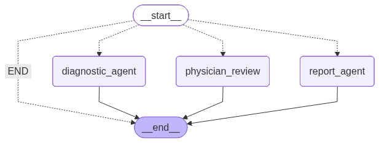
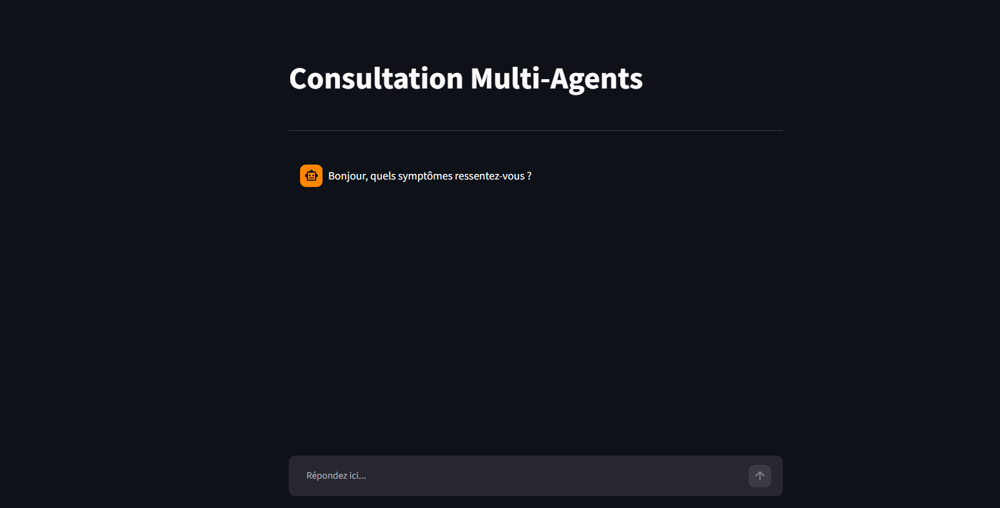
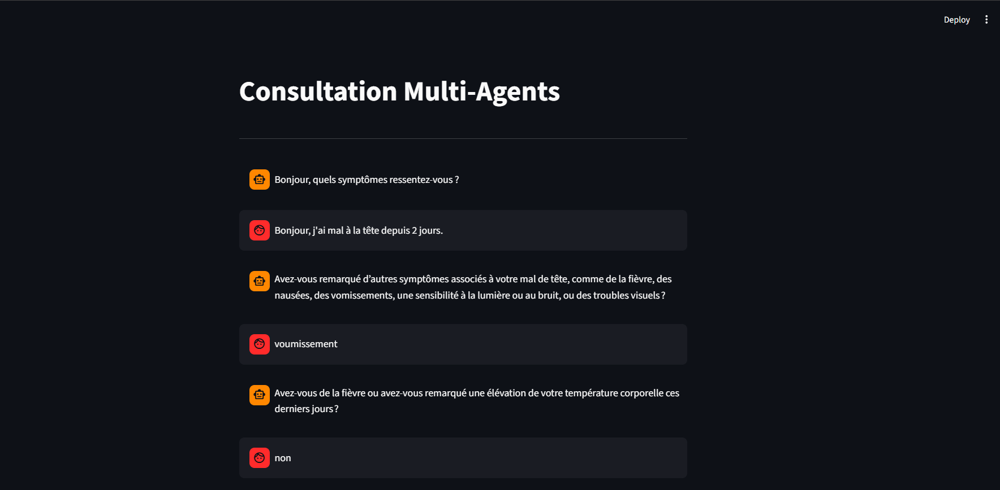
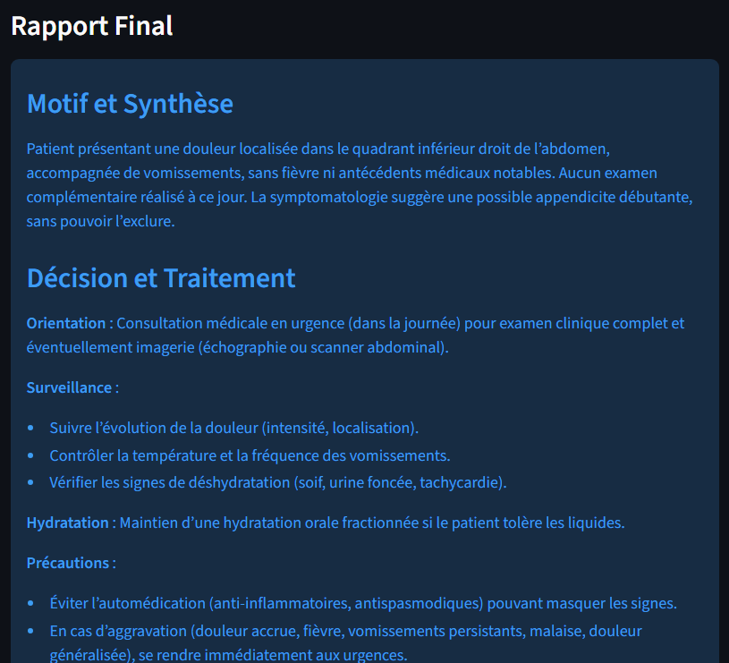
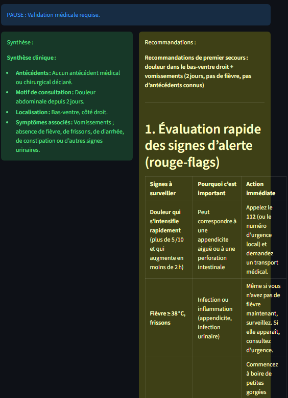

#  Assistant Médical Intelligent Multi-Agents

## Projet Académique

**Module :** Intelligence Artificielle et Systèmes Multi-Agents  
**Encadrant :** Dr. Mohammed Youssefi  
**Étudiante :** Rihab Assouli  
**Année Universitaire :** 2025 - 2026

---

#  Présentation du Projet

Ce projet consiste à développer un système intelligent d’assistance médicale basé sur une architecture multi-agents.

L’application permet de simuler une consultation médicale en utilisant plusieurs agents spécialisés capables de collaborer afin de :

- Collecter les informations du patient ;
- Analyser les symptômes ;
- Produire un résumé diagnostique ;
- Permettre une validation humaine (Human-in-the-Loop) ;
- Générer un rapport médical final.

L’orchestration des agents est réalisée à l’aide de LangGraph afin de gérer les transitions entre les différentes étapes du processus de consultation.

---

#  Objectifs du Projet

- Concevoir une architecture agentique intelligente ;
- Mettre en œuvre un système multi-agents coopératif ;
- Utiliser LangGraph pour l’orchestration des agents ;
- Assurer la persistance de l’état de la consultation ;
- Intégrer une validation humaine dans le processus décisionnel ;
- Générer automatiquement un rapport médical structuré.

---

#  Architecture du Système




#  Description des Agents

## 1. Supervisor Agent

Responsable de :

- La coordination des agents ;
- Le contrôle du workflow ;
- La gestion des transitions.

---

## 2. Diagnostic Agent

Responsable de :

- L’analyse des symptômes ;
- La génération du diagnostic préliminaire ;
- La création du résumé médical.

---

## 3. Physician Review Agent

Responsable de :

- La validation humaine ;
- La vérification du traitement proposé ;
- L’approche Human-in-the-Loop.

---

## 4. Report Agent

Responsable de :

- La génération du rapport final ;
- La synthèse des résultats de consultation.

---

#  Technologies Utilisées

- Python
- FastAPI
- LangGraph
- LangChain
- Streamlit
- MCP Server
- Pydantic

---

#  Structure du Projet

```text
backend/
│
├── app/
│   ├── api.py
│   ├── graph.py
│   ├── state.py
│   │
│   ├── nodes/
│   │   ├── diagnostic_agent.py
│   │   ├── physician_review.py
│   │   ├── report_agent.py
│   │   └── supervisor.py
│
├── test_graph.py
│
frontend/
│
└── frontend.py

mcp_server/
│
└── server.py
```

---

#  Installation

## Installation des dépendances

```bash
pip install -r app/requirements.txt
```

---

#  Lancement du Backend

```bash
cd backend
uvicorn app.api:app --reload
```

Documentation Swagger :

```text
http://127.0.0.1:8000/docs
```

---

# ▶️ Lancement du Frontend

```bash
streamlit run frontend/frontend.py
```

---

#  Captures d’Écran


## Interface Utilisateur

## Exemple de Consultation





---

#  Fonctionnalités Réalisées

- Architecture Multi-Agents
- Gestion du Workflow avec LangGraph
- Analyse des Symptômes
- Diagnostic Préliminaire
- Validation Humaine
- Génération de Rapport Médical
- API REST avec FastAPI
- Interface Utilisateur avec Streamlit
- Gestion de l’État de la Consultation

---

#  Perspectives d’Amélioration

- Intégration d’une base de données
- Authentification des utilisateurs
- Historique des consultations
- Support multilingue
- Intégration avec des dossiers médicaux électroniques

---

#  Conclusion

Ce projet démontre l’utilisation des systèmes multi-agents et des technologies d’IA générative dans le domaine médical.

L’approche adoptée permet d’orchestrer plusieurs agents spécialisés tout en conservant une validation humaine avant la génération du rapport final, garantissant ainsi une meilleure fiabilité des résultats.

---

#  Réalisé par

**Rihab Assouli**

Sous l’encadrement de :

**Dr. Mohammed Youssefi**